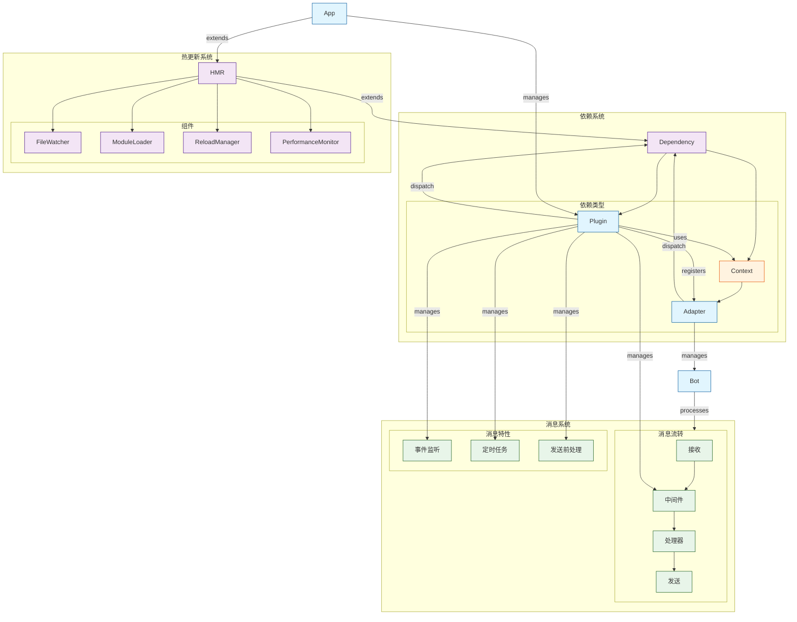

# Zhin Bot Framework

Zhin是一个现代化的、支持热模块替换(HMR)的TypeScript机器人框架。它提供了一个灵活的插件系统和多平台适配器支持，让你可以轻松构建和管理聊天机器人。

## 特性

- 🔥 内置热模块替换(HMR)支持，开发时无需重启
- 🎯 完全TypeScript支持，提供优秀的类型提示
- 🔌 插件化架构，易于扩展
- 🌈 多平台适配器支持(ICQQ, OneBot11等)
- 📦 基于pnpm的monorepo工作区管理
- 🚀 现代化的开发体验
- 🛠️ 完善的CLI工具支持

## 架构设计

Zhin框架采用模块化的架构设计，主要由以下几个核心部分组成：

### 核心组件 (Core Components)

- **App**: 框架的核心类，继承自HMR，负责管理整个应用的生命周期
- **Plugin**: 插件系统的基础类，继承自Dependency，提供消息处理、事件监听等功能
- **Context**: 上下文系统的基础，提供依赖注入和状态管理能力，现已支持描述信息用于系统文档化
- **Adapter**: Context的具体实现，作为平台适配器的上下文，管理Bot实例
- **Bot**: 机器人实例接口，定义了机器人的基本行为

### 热更新系统 (HMR System)

- **HMR**: 热模块替换的核心实现，提供代码热更新能力
- **FileWatcher**: 文件监听器，检测文件变化
- **ModuleLoader**: 模块加载器，负责模块的动态加载和更新
- **ReloadManager**: 重载管理器，协调模块重载过程
- **PerformanceMonitor**: 性能监控，追踪重载性能
- **Dependency**: 依赖管理的基础类，提供依赖树结构

### 消息流转 (Message Flow)

1. **消息接收** (Message Receive)
   - 通过Adapter接收平台消息
   - 转换为统一的消息格式

2. **消息处理** (Message Processing)
   - 经过中间件链处理
   - 路由到对应的消息处理器
   - 执行插件定义的处理逻辑

3. **消息发送** (Message Send)
   - 通过Adapter发送到对应平台
   - 支持发送前的消息处理

### 依赖系统 (Dependency System)

- **Dependency**: 提供基础的依赖管理和事件系统
  - 提供事件分发和广播机制
  - 管理依赖的生命周期
  - 支持依赖树结构
  - 提供上下文注册和管理

- **Context**: 基于Dependency的状态容器
  - 提供 mounted 和 dispose 生命周期
  - 支持异步初始化
  - 可被其他依赖使用和注入

- **Plugin**: 继承自Dependency的插件实现
  - 管理消息中间件
  - 处理事件监听
  - 管理定时任务
  - 提供消息发送前处理
  - 支持日志系统

- **Adapter**: 基于Context的平台适配器
  - 管理Bot实例的生命周期
  - 处理平台特定的消息格式
  - 提供统一的消息接口

### 系统架构图



## 项目结构

```
zhin-next/
├── adapters/           # 平台适配器
│   ├── icqq/          # ICQQ协议适配器
│   ├── onebot11/      # OneBot11协议适配器
│   └── process/       # 进程管理适配器
├── packages/          # 核心包
│   ├── cli/          # 命令行工具
│   ├── core/         # 核心功能模块
│   ├── create-zhin/  # 项目创建工具
│   ├── hmr/          # 热模块替换实现
│   ├── types/        # 类型定义
│   └── zhin/         # 主包
└── test-bot/         # 测试机器人示例
```

## 快速开始

1. 安装依赖
```bash
pnpm install
```

2. 创建新项目
```bash
pnpm create zhin my-bot
```

3. 开发模式启动
```bash
cd my-bot
pnpm dev
```

## 核心包说明

- `@zhin.js/core`: 框架核心功能实现
- `@zhin.js/cli`: 命令行工具，提供项目管理功能
- `@zhin.js/hmr`: 热模块替换实现
- `@zhin.js/types`: 类型定义
- `zhin.js`: 主包，整合所有功能

## 适配器

- `@zhin.js/adapter-icqq`: ICQQ协议适配器
- `@zhin.js/adapter-onebot11`: OneBot11协议适配器
- `@zhin.js/adapter-process`: 进程管理适配器

## 开发指南

- [插件开发](./packages/core/README.md)
- [适配器开发](./adapters/README.md)
- [CLI工具使用](./packages/cli/README.md)

## 贡献指南

欢迎提交Issue和Pull Request！

## 许可证

MIT License